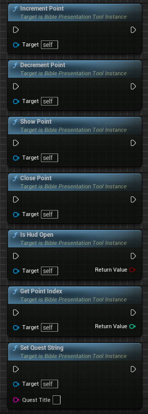

# BiblePresentationTool
 Interactive framework to assist Youth Pastors in engaging young people

## Why?
The idea for this project was to provide an alternative for presentation tools like ProPresenter and Powerpoint. Whilst the project at this point the example project only shows images, it provides the strong potential for developers to create visual 3D templates, allowing anybody to run the program, insert their presentation files in a folder, and adapt the template to the purpose they are wanting to use it for. This aims to create some interesting visuals and interaction with younger people who may struggle with focussing.

## How?
The idea for this project is that the presentation side has very little setup. By implementing the interface and player controller included in the source files, as well as creating a Blueprint based on the PointScreenWidget file, the developer should be able to easily edit presentation information using these accessible methods.

If you are testing this via the example project, on play you can open the Output Log and search for "PRESENTATION FOLDER". This will show you the executables running folder, where you can create the "PresentationData" folder. In this folder, add a sub folder for each PointGroup (Think of it as a mini presentation, the window will open, go through all of the sub points in the folder, then close once they are done). Inside each folder, add as many png or mp4 files as you would like, specifying the order with a predicate of 1., 2., 3. etc...

With the example project, the only API call you would need to make (similar to the Point Triggers) is a ShowPoint() call. This is due to the Player Controller handling the incrementation of points and groups.

## Example Project
Included in the Repo is an example project which I used to work on a few examples. These are, Taxi driving through a wasteland, Feeding the 5000 and Jesus walking on Water. These hopefully show the kind of ideas I had when implementing this project. Please feel free to migrate any blueprints over to your projects, especially the PointScreenWidgetBP.

## License
This project uses the MIT License. This means I am happy for this to be used for both Commercial and Non-Commercial usage, as long as I am visually creditted both in the license, and preferably somewhere in the visual end of the project also :)
